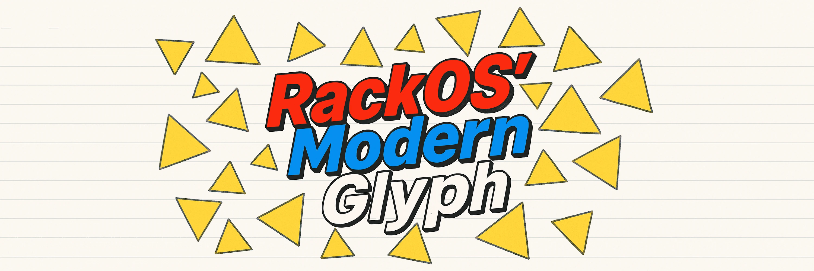

> [!CAUTION]
> **This project is in pre-alpha phase.**
>> [The Maintainer](https://github.com/megalisp) Has RackOS on a spare laptop, that he doesn't even daily-drive atm. Please don't use this yet.

      

      
(<strong>Note:</strong> You Gotta Pronounce Glyph like Glife, For Pun To Work. LOL)

  

  

  

  

#### ⚠️ TLDR

> 

> <strong>Aiming For A First-Class</strong> <a href="https://racket-lang.org">Racket</a> Based "Developer Experience" X "Desktop Environment" <code>Image</code> For The Emerging <a href="https://bootc-dev.github.io/bootc/">Bootc</a> ("Bootable Container") Ecosystem.
> 

 

---

### 💡 THE BIG IDEA
***Add What's The Big Idea***

---

### 🤔 THE FAQS
***Add just the faqs***

---

### 🖼️ Screenshots

**Coming Soon...**

---

### 🚧 Milestones

<table>
  <thead>
    <tr>
      <th width="5%">✓</th>
      <th width="15%">Milestone</th>
      <th width="80%">Description</th>
    </tr>
  </thead>
  <tbody>
    <tr>
      <td>✅</td>
      <td><strong>Builds</strong></td>
      <td><code>rackos</code> successfully builds via <code>bootc</code> and publishes to <code>ghcr.io</code> container registry using GitHub Actions.</td>
    </tr>
    <tr>
      <td>🟡</td>
      <td><strong>Graphical Boot</strong></td>
      <td>Boots directly into a graphical session (Xorg + <code>Openbox</code>) from within the bootable container image and with `ujust distrobox-gui` from the container</td>
    </tr>
    <tr>
      <td>🔲</td>
      <td><strong>Running Rawind</strong></td>
      <td>The graphical session should be in / directed towards Racket itself; Make It Boot Into A Rawind Session.</td>
    </tr>
    <tr>
      <td>🔲</td>
      <td><strong>Fleshing out</strong></td>
      <td>Flesh out the default session; Make it a first-class development and even desktop experience for Racket.</td>
    </tr>
    <tr>
      <td>🔲</td>
      <td><strong>Onboarding</strong></td>
      <td>Should boot into a first-startup config session app to make a user from default, and various other things</td>
    </tr>
    <tr>
      <td>➕</td>
      <td><strong>And More</strong></td>
      <td>But until we get to this point, I don't even see it as "minimally viable product" status.</td>
    </tr>
  </tbody>
</table>

---

## ⚡ Getting Started
(Currently you'll need some familarity with either containers and/or Fedora Atomic Desktops. This is something we hope to ease long-term with providing ISOs and VM images as-well as what we have now.)

### Rebase from an existing Fedora Atomic install

If you're already on Silverblue, Bluefin, Kinoite, Bazzite, Aurora, or the like:

    rpm-ostree rebase ostree-unverified-registry:ghcr.io/megalisp/rackos:latest

## OR

### Try in a container

    podman run --rm -it ghcr.io/megalisp/rackos:latest bash

## Preferably,
### Run it via distrobox
(For just-works support for stuff like Dr.Racket)

      distrobox create --name rackos --image ghcr.io/megalisp/rackos:latest
      distrobox enter rackos

Note: We don't have a good way to launch the full graphical-environment from the hosted contianer yet.

---

## 🌟 Related Projects

&nbsp;&nbsp;&nbsp;&nbsp;⭐️ [**Rawind**](https://github.com/megalisp/rawind)  
&nbsp;&nbsp;&nbsp;&nbsp;&nbsp;&nbsp;&nbsp;&nbsp;&nbsp;&nbsp;Lightweight, customizable window manager optimized for programmable workflows.

&nbsp;&nbsp;&nbsp;&nbsp;⭐️ [**Rapps**](https://github.com/megalisp/rapps)  
&nbsp;&nbsp;&nbsp;&nbsp;&nbsp;&nbsp;&nbsp;&nbsp;&nbsp;&nbsp;Suite of Racket-powered GUI apps focused on rapid development and productivity.

&nbsp;&nbsp;&nbsp;&nbsp;⭐️ [**Remux**](https://github.com/megalisp/remux)  
&nbsp;&nbsp;&nbsp;&nbsp;&nbsp;&nbsp;&nbsp;&nbsp;&nbsp;&nbsp;Efficient UI toolkit designed for dynamic interfaces within RackOS.

*And probably more to come...?*

---

## 🙌 Acknowledgments

- 🎾 [Racket](https://racket-lang.org) — for providing such a stable foundation / a language to build everything on
- 💙 [Universal Blue](https://universal-blue.org) — for making the container ecosystem so approachable on 'desktop linux'
- ⚛️ [Fedora Atomic](https://fedoraproject.org/atomic-desktops/) - for the underlying project, initiative that we're running on-top of
- 📦 [bootc](https://bootc-dev.github.io/bootc/) — for making bootable containers real / viable in the first-place.
- 🌐 [Everyone & Anyone Else]() - for the literal 1000s of people and projects that made this one possible. o7

---

## 📊 Analytics

  

<a href="https://star-history.com/#megalisp/rackos&Date">
  <picture>
    <source media="(prefers-color-scheme: dark)" srcset="https://api.star-history.com/svg?repos=megalisp/rackos&type=Date&theme=dark" />
    <source media="(prefers-color-scheme: light)" srcset="https://api.star-history.com/svg?repos=megalisp/rackos&type=Date" />
    
  </picture>
</a>

